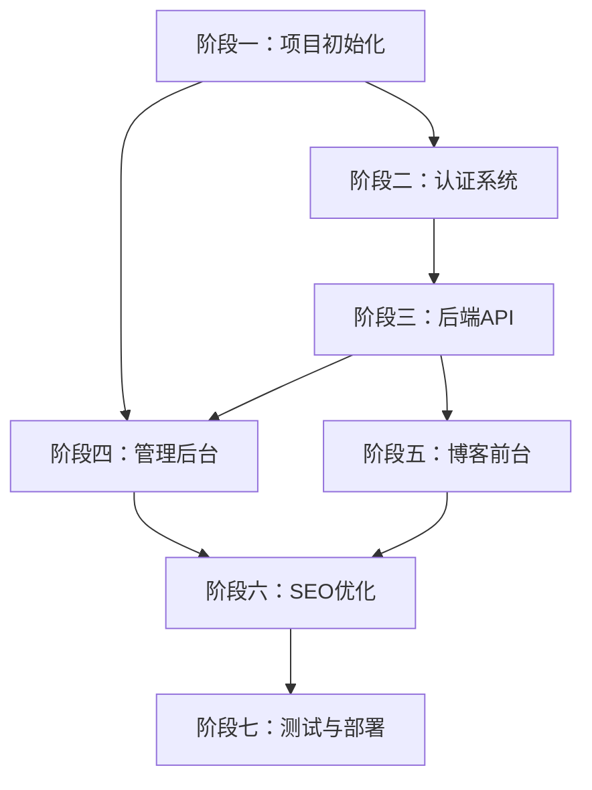
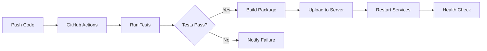

# 博客系统 PRD 产品需求文档

## 一、项目概述

| 项目名称 | 个人技术博客系统                                              |
| -------- | ------------------------------------------------------------- |
| 项目类型 | Web应用（前台 + 管理后台）                                    |
| 核心定位 | 专注于技术分享的个人博客，支持内容分类、系列专题、SEO优化，适合技术爱好者、学习者、从业者阅读 |
| 目标用户 | 技术爱好者、前端/后端开发者、程序员、CTO/技术经理、正在学习编程的学生 |
| 设计原则 | 简洁友好、阅读舒适、加载快速、内容为王                        |

---

## 二、需求概述

### 2.1 功能需求

| 序号 | 模块 | 功能描述 | 优先级 |
| ---- | ---- | -------- | ------ |
| 1 | 分类体系 | 双维度分类：内容分类（前端/后端/工具/随笔）+ 系列专题（Vue3/React等） | P0 |
| 2 | 首页展示 | 多模块：精选文章、最新文章、热门文章、系列专题、标签云 | P0 |
| 3 | 文章详情 | Markdown渲染、代码高亮、目录导航、分类/标签、上下篇 | P0 |
| 4 | 管理后台 | 登录认证、文章CRUD、分类/系列管理、精选推荐 | P0 |
| 5 | 暗色主题 | 支持手动切换+跟随系统，深色/浅色两种模式 | P0 |
| 6 | 阅读体验 | 文章字数、预估阅读时长、阅读进度条 | P0 |
| 7 | SEO优化 | SSR/SSG、Metadata、Sitemap、RSS、结构化数据、百度推送 | P0 |
| 8 | 搜索功能 | 按标题/内容搜索 | P1 |
| 9 | 文章分享 | 一键复制链接、社交平台分享 | P1 |
| 10 | 图片预览 | 点击图片放大查看 | P1 |
| 11 | 文章预览 | 后台发布前预览真实效果 | P0 |
| 12 | 图片粘贴上传 | 编辑器支持Ctrl+V直接粘贴图片 | P1 |
| 13 | 定时发布 | 设置未来时间自动发布 | P2 |
| 14 | 草稿箱 | 独立的草稿列表管理 | P1 |
| 15 | 回收站 | 已删除文章可恢复，30天后自动清理 | P2 |

### 2.2 非功能需求

| 类别 | 要求 |
| ---- | ---- |
| 性能 | 首屏加载 < 1.5s，LCP < 2.5s |
| SEO | 百度/Google 收录友好，结构化数据完善 |
| 响应式 | 完美支持 PC / 平板 / 手机 |
| 可维护性 | 代码结构清晰，组件化开发 |
| 可访问性 | 颜色对比度WCAG AA级，支持键盘导航，支持字体缩放 |
| 主题 | 支持暗色/亮色模式，支持跟随系统或手动切换 |

---

## 三、用户流程

### 3.1 访客流程

```
访问首页 → 浏览多模块展示 → 点击文章 → 阅读详情 → 返回/搜索/分类筛选
```

### 3.2 管理员流程

```
访问后台 → 登录 → 管理文章 → 创建/编辑/发布 → 返回前台预览
```

---

## 四、页面结构

### 4.1 前台页面

| 路径             | 说明                             |
| ---------------- | -------------------------------- |
| `/`              | 首页：精选/最新/热门/系列/标签云 |
| `/posts`         | 文章列表：支持分类/标签/系列筛选 |
| `/posts/[slug]`  | 文章详情                         |
| `/series`        | 系列专题列表                     |
| `/series/[slug]` | 系列专题详情                     |
| `/tags`          | 标签云                           |
| `/about`         | 关于页                           |
| `/search?q=xxx`  | 搜索结果                         |

### 4.2 管理后台

| 路径 | 说明 |
| ---- | ---- |
| `/admin/login` | 登录页 |
| `/admin/dashboard` | 仪表盘：数据统计 |
| `/admin/posts` | 文章列表 |
| `/admin/posts/drafts` | 草稿箱 |
| `/admin/posts/trash` | 回收站 |
| `/admin/posts/new` | 新建文章 |
| `/admin/posts/[id]/edit` | 编辑文章 |
| `/admin/posts/[id]/preview` | 文章预览 |
| `/admin/categories` | 内容分类管理 |
| `/admin/series` | 系列专题管理 |
| `/admin/tags` | 标签管理 |
| `/admin/settings` | 系统设置（主题配置等） |

---

## 五、数据库设计

### 5.1 表结构

```sql
-- 管理员用户
CREATE TABLE `users` (
  `id` BIGINT PRIMARY KEY AUTO_INCREMENT COMMENT '用户ID',
  `email` VARCHAR(255) UNIQUE NOT NULL COMMENT '邮箱',
  `password_hash` VARCHAR(255) NOT NULL COMMENT '密码哈希',
  `name` VARCHAR(100) COMMENT '姓名',
  `role` VARCHAR(20) DEFAULT 'admin' COMMENT '角色: admin/editor',
  `created_at` DATETIME DEFAULT CURRENT_TIMESTAMP COMMENT '创建时间',
  INDEX `idx_email` (`email`)
) ENGINE=InnoDB DEFAULT CHARSET=utf8mb4 COMMENT='管理员用户表';

-- 内容分类（如：前端、后端、工具、随笔）
CREATE TABLE `categories` (
  `id` BIGINT PRIMARY KEY AUTO_INCREMENT COMMENT '分类ID',
  `name` VARCHAR(50) NOT NULL COMMENT '分类名称',
  `slug` VARCHAR(50) UNIQUE NOT NULL COMMENT 'URL别名',
  `description` TEXT COMMENT '分类描述',
  `sort_order` INT DEFAULT 0 COMMENT '排序',
  `created_at` DATETIME DEFAULT CURRENT_TIMESTAMP COMMENT '创建时间',
  INDEX `idx_slug` (`slug`)
) ENGINE=InnoDB DEFAULT CHARSET=utf8mb4 COMMENT='内容分类表';

-- 系列专题（如：Vue3系列、React系列）
CREATE TABLE `series` (
  `id` BIGINT PRIMARY KEY AUTO_INCREMENT COMMENT '系列ID',
  `name` VARCHAR(100) NOT NULL COMMENT '系列名称',
  `slug` VARCHAR(100) UNIQUE NOT NULL COMMENT 'URL别名',
  `description` TEXT COMMENT '系列描述',
  `cover_image` VARCHAR(500) COMMENT '封面图',
  `created_at` DATETIME DEFAULT CURRENT_TIMESTAMP COMMENT '创建时间',
  INDEX `idx_slug` (`slug`)
) ENGINE=InnoDB DEFAULT CHARSET=utf8mb4 COMMENT='系列专题表';

-- 文章
CREATE TABLE `posts` (
  `id` BIGINT PRIMARY KEY AUTO_INCREMENT COMMENT '文章ID',
  `title` VARCHAR(200) NOT NULL COMMENT '标题',
  `slug` VARCHAR(200) UNIQUE NOT NULL COMMENT 'URL别名',
  `content` TEXT NOT NULL COMMENT '内容',
  `excerpt` TEXT COMMENT '摘要',
  `cover_image` VARCHAR(500) COMMENT '封面图',
  `category_id` BIGINT COMMENT '分类ID',
  `series_id` BIGINT COMMENT '系列ID',
  `is_featured` TINYINT(1) DEFAULT 0 COMMENT '是否精选',
  `status` VARCHAR(20) DEFAULT 'draft' COMMENT '状态: draft/published/scheduled/trash',
  `view_count` INT DEFAULT 0 COMMENT '浏览量',
  `word_count` INT DEFAULT 0 COMMENT '字数',
  `published_at` DATETIME COMMENT '发布时间',
  `scheduled_at` DATETIME COMMENT '定时发布时间',
  `is_deleted` TINYINT(1) DEFAULT 0 COMMENT '是否删除（回收站）',
  `deleted_at` DATETIME COMMENT '删除时间',
  `created_at` DATETIME DEFAULT CURRENT_TIMESTAMP COMMENT '创建时间',
  `updated_at` DATETIME DEFAULT CURRENT_TIMESTAMP ON UPDATE CURRENT_TIMESTAMP COMMENT '更新时间',
  FOREIGN KEY (`category_id`) REFERENCES `categories`(`id`) ON DELETE SET NULL,
  FOREIGN KEY (`series_id`) REFERENCES `series`(`id`) ON DELETE SET NULL,
  INDEX `idx_slug` (`slug`),
  INDEX `idx_status` (`status`),
  INDEX `idx_category` (`category_id`),
  INDEX `idx_series` (`series_id`),
  INDEX `idx_published` (`published_at`),
  INDEX `idx_deleted` (`is_deleted`),
  INDEX `idx_scheduled` (`scheduled_at`)
) ENGINE=InnoDB DEFAULT CHARSET=utf8mb4 COMMENT='文章表';

-- 标签
CREATE TABLE `tags` (
  `id` BIGINT PRIMARY KEY AUTO_INCREMENT COMMENT '标签ID',
  `name` VARCHAR(50) NOT NULL COMMENT '标签名称',
  `slug` VARCHAR(50) UNIQUE NOT NULL COMMENT 'URL别名',
  INDEX `idx_slug` (`slug`)
) ENGINE=InnoDB DEFAULT CHARSET=utf8mb4 COMMENT='标签表';

-- 文章-标签关联
CREATE TABLE `post_tags` (
  `post_id` BIGINT NOT NULL COMMENT '文章ID',
  `tag_id` BIGINT NOT NULL COMMENT '标签ID',
  PRIMARY KEY (`post_id`, `tag_id`),
  FOREIGN KEY (`post_id`) REFERENCES `posts`(`id`) ON DELETE CASCADE,
  FOREIGN KEY (`tag_id`) REFERENCES `tags`(`id`) ON DELETE CASCADE
) ENGINE=InnoDB DEFAULT CHARSET=utf8mb4 COMMENT='文章标签关联表';

-- 系统设置
CREATE TABLE `settings` (
  `id` BIGINT PRIMARY KEY AUTO_INCREMENT COMMENT '设置ID',
  `setting_key` VARCHAR(50) UNIQUE NOT NULL COMMENT '设置键',
  `setting_value` TEXT COMMENT '设置值',
  `created_at` DATETIME DEFAULT CURRENT_TIMESTAMP COMMENT '创建时间',
  `updated_at` DATETIME DEFAULT CURRENT_TIMESTAMP ON UPDATE CURRENT_TIMESTAMP COMMENT '更新时间'
) ENGINE=InnoDB DEFAULT CHARSET=utf8mb4 COMMENT='系统设置表';

-- 初始化默认设置
INSERT INTO `settings` (`setting_key`, `setting_value`) VALUES
('theme_mode', 'auto'),  -- auto/light/dark
('site_title', '我的技术博客'),
('site_description', '一个专注于技术分享的博客'),
('posts_per_page', '10'),
('enable_rss', '1'),
('enable_comment', '0');
```

### 5.2 API 接口

#### 5.2.0 接口规范

**统一响应格式**
```json
// 成功响应
{
  "code": 200,
  "message": "success",
  "data": { }
}

// 失败响应
{
  "code": 400,
  "message": "参数错误",
  "data": null
}

// 分页响应
{
  "code": 200,
  "message": "success",
  "data": {
    "records": [],
    "total": 100,
    "current": 1,
    "pageSize": 10,
    "pages": 10
  }
}
```

**状态码规范**
| 状态码 | 说明 | 使用场景 |
| ---- | ---- | -------- |
| 200 | 成功 | 请求成功 |
| 400 | 请求参数错误 | 参数校验失败 |
| 401 | 未认证 | Token 缺失或无效 |
| 403 | 无权限 | 权限不足 |
| 404 | 资源不存在 | 查询的资源不存在 |
| 500 | 服务器错误 | 后端异常 |

**请求头规范**
```http
Content-Type: application/json
Authorization: Bearer {token}
```

**分页参数**
```typescript
interface PageParams {
  current: number;  // 当前页，默认 1
  pageSize: number; // 每页条数，默认 10，最大 100
}
```

**前端 API 封装示例**
```typescript
// api/request.ts - Axios 封装
import axios from 'axios';

const request = axios.create({
  baseURL: process.env.NEXT_PUBLIC_API_URL || 'http://localhost:8080/api',
  timeout: 10000,
});

// 请求拦截器 - 注入 Token
request.interceptors.request.use(
  (config) => {
    const token = localStorage.getItem('token');
    if (token) {
      config.headers.Authorization = `Bearer ${token}`;
    }
    return config;
  },
  (error) => Promise.reject(error)
);

// 响应拦截器 - 统一处理
request.interceptors.response.use(
  (response) => {
    const { code, data, message } = response.data;
    if (code === 200) {
      return data;
    }
    // Token 过期
    if (code === 401) {
      localStorage.removeItem('token');
      window.location.href = '/admin/login';
    }
    return Promise.reject(new Error(message));
  },
  (error) => {
    // 网络错误或服务器错误
    return Promise.reject(error);
  }
);

export default request;
```

**Mock 数据策略**
```typescript
// 开发环境使用 Mock 数据
// mock/posts.ts
import { MockMethod } from 'vite-plugin-mock';

export default [
  {
    url: '/api/posts',
    method: 'get',
    response: ({ query }) => {
      return {
        code: 200,
        message: 'success',
        data: {
          records: [
            { id: 1, title: 'Mock 文章', content: '...' }
          ],
          total: 1,
          current: 1,
          pageSize: 10,
        },
      };
    },
  },
] as MockMethod[];
```

#### 5.2.1 认证接口

| 方法 | 路径 | 说明 | 认证 |
| ---- | ---- | ---- | ---- |
| POST | `/api/auth/login` | 管理员登录 | 否 |
| POST | `/api/auth/logout` | 登出 | 是 |
| GET | `/api/auth/me` | 获取当前用户信息 | 是 |

#### 5.2.2 文章接口

| 方法 | 路径 | 说明 | 认证 |
| ---- | ---- | ---- | ---- |
| GET | `/api/posts` | 获取文章列表（支持分页、分类、系列、标签筛选） | 否 |
| GET | `/api/posts/[slug]` | 获取文章详情 | 否 |
| POST | `/api/posts` | 创建文章 | 是 |
| PUT | `/api/posts/[id]` | 更新文章 | 是 |
| DELETE | `/api/posts/[id]` | 删除文章 | 是 |
| PUT | `/api/posts/[id]/publish` | 发布/下架文章 | 是 |
| PUT | `/api/posts/[id]/featured` | 设置/取消精选 | 是 |

#### 5.2.3 分类/系列/标签接口

| 方法 | 路径 | 说明 | 认证 |
| ---- | ---- | ---- | ---- |
| GET | `/api/categories` | 获取分类列表 | 否 |
| POST | `/api/categories` | 创建分类 | 是 |
| PUT | `/api/categories/[id]` | 更新分类 | 是 |
| DELETE | `/api/categories/[id]` | 删除分类 | 是 |
| GET | `/api/series` | 获取系列列表 | 否 |
| POST | `/api/series` | 创建系列 | 是 |
| PUT | `/api/series/[id]` | 更新系列 | 是 |
| DELETE | `/api/series/[id]` | 删除系列 | 是 |
| GET | `/api/tags` | 获取标签列表 | 否 |
| POST | `/api/tags` | 创建标签 | 是 |
| DELETE | `/api/tags/[id]` | 删除标签 | 是 |

#### 5.2.4 搜索与统计接口

| 方法 | 路径 | 说明 | 认证 |
| ---- | ---- | ---- | ---- |
| GET | `/api/search?q=` | 搜索文章 | 否 |
| GET | `/api/stats` | 获取站点统计数据 | 是 |
| GET | `/api/posts/[slug]/related` | 获取相关文章推荐 | 否 |

#### 5.2.5 请求参数规范

**分页参数**
```typescript
interface PaginationParams {
  page?: number;      // 默认 1
  pageSize?: number;   // 默认 10，最大 50
}
```

**文章列表筛选**
```typescript
interface PostListParams extends PaginationParams {
  category?: string;  // 分类slug
  series?: string;     // 系列slug
  tag?: string;        // 标签slug
  status?: 'draft' | 'published';
  featured?: boolean;
  sortBy?: 'created_at' | 'published_at' | 'view_count';
  sortOrder?: 'asc' | 'desc';
}
```

**文章响应结构**
```typescript
interface PostListResponse {
  data: Post[];
  pagination: {
    page: number;
    pageSize: number;
    total: number;
    totalPages: number;
  };
}

interface Post {
  id: string;
  title: string;
  slug: string;
  excerpt: string;
  coverImage: string;
  category: Category;
  series: Series;
  tags: Tag[];
  isFeatured: boolean;
  status: string;
  viewCount: number;
  publishedAt: string;
  createdAt: string;
  updatedAt: string;
}
```

---

## 六、安全与权限设计

### 6.1 认证机制

| 项目 | 方案 |
| ---- | ---- |
| 登录方式 | 邮箱 + 密码 |
| 密码加密 | BCryptPasswordEncoder |
| Session | JWT Token（io.jsonwebtoken:jjwt） |
| Token有效期 | 7天 |
| Token存储 | localStorage（前端） |
| 刷新机制 | 过期自动跳转登录 |

#### JWT 配置示例
```yaml
# application.yml
jwt:
  secret: your-secret-key-at-least-256-bits
  expiration: 604800000  # 7天（毫秒）
  header: Authorization
  prefix: Bearer
```

### 6.2 权限控制

| 角色 | 权限范围 |
| ---- | -------- |
| admin | 全部权限（包括用户管理） |
| editor | 文章/分类/系列/标签管理（不可删除、不可管理用户） |

#### Spring Security 配置
```java
// 权限注解使用
@PreAuthorize("hasRole('ADMIN')")
@PreAuthorize("hasAnyRole('ADMIN', 'EDITOR')")
```

### 6.3 安全防护

| 防护项 | 实现方案 |
| ---- | -------- |
| 密码强度校验 | 前端正则 + 后端验证 |
| 登录失败限制 | Redis 计数器，5次锁定15分钟 |
| API 请求频率限制 | 拦截器 + Redis，单IP每分钟60次 |
| XSS 防护 | 前端输入过滤 + 后端转义 |
| SQL 注入防护 | MyBatis 参数化查询 |
| CSRF 防护 | Spring Security 默认启用（可选择性禁用） |
| CORS 配置 | CorsConfigurationSource 配置允许的域名 |
| 敏感信息保护 | 生产环境配置文件加密，日志脱敏 |

#### 安全检查清单
- [ ] 密码强度校验（至少8位，包含大小写+数字）
- [ ] 登录失败次数限制
- [ ] API 请求频率限制
- [ ] XSS 防护（输入过滤+输出转义）
- [ ] SQL 注入防护（参数化查询）
- [ ] CORS 策略配置
- [ ] 敏感信息不上传至客户端（如密码、Token）
- [ ] HTTPS 生产环境强制开启

---

## 七、运营与数据分析

### 7.1 统计数据

| 指标 | 说明 |
| ---- | ---- |
| 总文章数 | 已发布文章数量 |
| 总浏览量 | 所有文章累计访问量 |
| 今日浏览量 | 当日访问量 |
| 精选文章数 | is_featured = true 的文章数 |

### 7.2 热门内容排行

| 排行 | 数据来源 |
| ---- | -------- |
| 热门文章 | 近30天浏览量Top10 |
| 热门标签 | 文章关联数Top10 |
| 新增文章 | 近7天发布的文章 |

### 7.3 管理员仪表盘

- 数据概览卡片
- 近期发布文章列表
- 快捷操作入口（新建文章、查看站点）

---

## 八、风险评估与应对

### 8.1 技术风险

| 风险 | 影响 | 应对措施 |
| ---- | ---- | -------- |
| Supabase 服务不稳定 | 高 | 做好数据备份，考虑备选方案 |
| SEO 收录效果差 | 中 | 持续优化 Metadata、结构化数据 |
| 首屏加载慢 | 中 | SSR/SSG优化、图片压缩、CDN |

### 8.2 数据风险

| 风险 | 影响 | 应对措施 |
| ---- | ---- | -------- |
| 文章数据丢失 | 高 | Supabase 自动备份 |
| 误删除文章 | 高 | 软删除机制（is_deleted字段） |

### 8.3 实施风险

| 风险 | 影响 | 应对措施 |
| ---- | ---- | -------- |
| 开发周期超期 | 中 | 优先MVP，按优先级砍需求 |
| Markdown兼容问题 | 低 | 充分测试，使用成熟库 |

---

## 九、UI/UX 设计规范

### 9.1 视觉风格

| 项目 | 规范 |
| ---- | ---- |
| 风格 | 简约、干净、阅读友好 |
| 配色-亮色 | 主色#1a1a1a，辅色#666666，强调色#2563EB |
| 配色-暗色 | 主色#e5e5e5，辅色#a3a3a3，强调色#60a5FA |
| 字体 | 标题：Inter / 正文：system-ui |
| 间距 | 8px 网格系统 |
| 圆角 | 8px（卡片）、4px（按钮） |

### 9.1.1 主题系统

#### 亮色模式（默认）
```css
:root {
  --bg-primary: #ffffff;
  --bg-secondary: #f9fafb;
  --bg-tertiary: #f3f4f6;
  --text-primary: #1a1a1a;
  --text-secondary: #666666;
  --text-muted: #9ca3af;
  --border-color: #e5e7eb;
  --accent: #2563EB;
  --accent-hover: #1d4ed8;
}
```

#### 暗色模式
```css
[data-theme="dark"] {
  --bg-primary: #1a1a1a;
  --bg-secondary: #262626;
  --bg-tertiary: #333333;
  --text-primary: #e5e5e5;
  --text-secondary: #a3a3a3;
  --text-muted: #737373;
  --border-color: #404040;
  --accent: #60a5FA;
  --accent-hover: #3b82f6;
}
```

#### 主题切换策略
| 方式 | 说明 | 优先级 |
| ---- | ---- | ---- |
| 系统跟随 | 读取 `prefers-color-scheme`，自动切换 | P0 |
| 手动切换 | 导航栏提供切换按钮，保存到localStorage | P0 |
| 页面过渡 | 切换时平滑过渡，避免闪烁 | P1 |

### 9.2 响应式断点

| 断点 | 宽度范围 | 典型设备 | 布局策略 |
| ---- | -------- | -------- | -------- |
| xs | < 640px | 手机竖屏 | 单栏，隐藏侧边栏 |
| sm | 640px - 767px | 手机横屏/小平板 | 单栏，紧凑布局 |
| md | 768px - 1023px | 平板竖屏 | 双栏，内容区缩窄 |
| lg | 1024px - 1279px | 平板横屏/小桌面 | 双栏，侧边栏显示 |
| xl | 1280px - 1535px | 桌面标准 | 三栏，全功能布局 |
| 2xl | ≥ 1536px | 大屏幕 | 三栏，居中最大宽度1440px |

### 9.3 浏览器窗口适配策略

| 场景 | 处理方案 |
| ---- | -------- |
| 窗口过小(<320px) | 允许横向滚动，避免内容截断 |
| 平板横竖屏 | 竖屏单栏，横屏双栏 |
| 大屏幕(>1920px) | 内容区最大宽度1440px，两侧留白 |
| 超宽屏(>2560px) | 居中布局，最大宽度1680px |
| 窗口缩放 | 响应式布局自动适配，无需额外处理 |

### 9.4 响应式元素规范

| 元素 | xs/sm | md | lg/xl/2xl |
| ---- | ---- | ---| ---- |
| 导航栏 | 汉堡菜单 | 紧凑导航 | 完整导航 |
| 文章卡片 | 横向铺满 | 双列 | 三列/四列 |
| 侧边栏 | 折叠/隐藏 | 底部/侧边 | 固定侧边 |
| 目录导航 | 底部悬浮 | 侧边固定 | 侧边固定 |
| 字体基准 | 14px | 15px | 16px |
| 间距基准 | 4px | 6px | 8px |
| 图片 | 100%宽度 | 保持比例 | 固定最大宽度 |

### 9.5 组件清单

| 组件 | 说明 |
| ---- | ---- |
| Header | 导航栏：Logo、导航链接、主题切换、搜索 |
| Footer | 底部：版权、社交链接 |
| PostCard | 文章卡片：封面、标题、摘要、日期、分类 |
| PostList | 文章列表 |
| PostDetail | 文章详情页 |
| TableOfContents | 目录导航 |
| TagCloud | 标签云 |
| SeriesCard | 系列专题卡片 |
| MarkdownEditor | Markdown编辑器 |
| AdminLayout | 后台布局 |
| ThemeToggle | 主题切换按钮 |
| ReadingProgress | 阅读进度条 |
| ShareButtons | 文章分享按钮 |
| ImagePreview | 图片预览模态框 |
| ArticleMeta | 文章元信息（字数、阅读时长） |

### 9.6 可访问性设计规范

#### 颜色对比度
| 场景 | 最低对比度 | 推荐值 |
| ---- | ---------- | ------ |
| 正文文字 | 4.5:1 | 7:1 |
| 大标题 | 3:1 | 4.5:1 |
| 按钮文字 | 4.5:1 | 7:1 |
| 链接 | 4.5:1 | 7:1 |
| 禁用状态 | 3:1 | - |

#### 字体与缩放
| 项目 | 规范 |
| ---- | ---- |
| 默认字号 | 16px（正文） |
| 最小字号 | 14px（移动端） |
| 标题层级 | h1: 32px, h2: 24px, h3: 20px, h4: 18px |
| 行高 | 1.6 - 1.8 |
| 字间距 | normal |
| 字体缩放 | 支持Ctrl+滚轮缩放，最大200% |

#### 键盘导航
| 元素 | 要求 |
| ---- | ---- |
| 焦点样式 | 可见的焦点轮廓（2px solid accent） |
| 跳转顺序 | 逻辑顺序，符合视觉顺序 |
| 快捷键 | Tab切换，Enter/空格激活 |
| 跳过链接 | 提供"跳到内容"链接 |

#### 屏幕阅读器支持
| 项目 | 要求 |
| ---- | ---- |
| ARIA标签 | 按钮/链接有明确的aria-label |
| 图片alt | 所有图片有描述性alt |
| 语义化HTML | 使用header/main/footer/article等标签 |
| 动态内容 | 状态变化时通知屏幕阅读器 |

#### 加载与错误状态
| 场景 | 处理方式 |
| ---- | -------- |
| 网络慢 | 显示骨架屏，不显示白屏 |
| 图片加载失败 | 显示占位图和alt文字 |
| API失败 | 显示友好错误提示 |
| 404 | 提供返回首页链接 |

---

## 十、SEO 优化方案

### 10.1 基础SEO

| 优化项 | 实现方式 |
| ---- | ---- |
| SSR/SSG | Next.js App Router + generateStaticParams |
| Metadata | 每个页面完整的 title、description、og:* |
| Sitemap | next-sitemap 自动生成 |
| RSS | /feed.xml 订阅源 |
| 结构化数据 | Article、BlogPosting JSON-LD |
| 性能 | 图片优化（next/image）、代码分割 |

### 10.2 增强SEO

| 优化项 | 实现方式 | 优先级 |
| ---- | ---- | ---- |
| 百度自动推送 | 发布文章时自动推送给百度搜索平台 | P1 |
| SEO预览 | 后台模拟百度/Google搜索结果展示 | P1 |
| 404页面优化 | 显示热门文章推荐，降低跳出率 | P1 |
| 死链检测 | 定期检测并修复失效链接 | P2 |
| 内部链接优化 | 文章底部推荐相关文章 | P0 |
| 面包屑导航 | 支持百度收录 | P1 |

### 10.3 SEO检查清单

- [ ] 每个页面有唯一的 title 和 description
- [ ] H1 标签每个页面只有一个
- [ ] 图片都有 alt 属性
- [ ] 链接都是可点击的文本
- [ ] URL 简洁且包含关键词
- [ ] 结构化数据测试通过
- [ ] 移动端体验符合要求
- [ ] 页面加载速度符合要求

### 10.4 结构化数据示例

```json
{
  "@context": "https://schema.org",
  "@type": "BlogPosting",
  "headline": "文章标题",
  "image": ["封面图URL"],
  "author": {
    "@type": "Person",
    "name": "作者名称"
  },
  "datePublished": "发布时间",
  "dateModified": "更新时间",
  "description": "文章摘要"
}
```

---

## 十一、技术栈

| 层级        | 技术选型                         |
| ----------- | -------------------------------- |
| 前端框架    | Next.js 15+ (App Router)         |
| 前端语言    | TypeScript                       |
| UI框架      | Tailwind CSS + shadcn/ui         |
| 状态管理    | Zustand                          |
| 内容格式    | Markdown + rehype/remark         |
| 后端语言    | Java 8+                          |
| 后端框架    | Spring Boot 2.x                  |
| 数据库      | MySQL 5.7+ / 8.0                 |
| ORM         | MyBatis-Plus                     |
| 代码高亮    | Prism.js / Shiki                 |
| 前端部署    | Nginx                            |
| 后端部署    | 腾讯云 Windows Server + Tomcat   |

---

## 十二、开发计划

### 12.1 阶段一：项目初始化与基础设施（1.5天）

#### 任务列表
**前端项目（0.5天）**
- [ ] Next.js 15 项目初始化（App Router）
- [ ] TypeScript + Tailwind CSS + shadcn/ui 配置
- [ ] 环境变量配置（.env.local 模板）
- [ ] ESLint + Prettier 代码规范配置
- [ ] 基础布局组件创建（前台Layout、后台Layout）

**后端项目（0.5天）**
- [ ] Spring Boot 项目创建（Spring Initializr）
- [ ] Maven 依赖配置（MyBatis-Plus、MySQL驱动、JWT、Spring Security）
- [ ] 项目目录结构搭建
- [ ] application.yml 配置（数据库、JWT等）
- [ ] 统一返回结果封装
- [ ] 全局异常处理

**数据库（0.5天）**
- [ ] MySQL 数据库创建
- [ ] 执行建表 SQL 脚本
- [ ] 插入测试数据

#### 交付物
- 可运行的前后端项目骨架
- MySQL 数据库表结构创建完成
- 前后端环境配置文档

#### 验收标准
- 前端 `npm run dev` 可正常启动
- 后端 Spring Boot 可正常启动
- 数据库连接测试成功

### 12.2 阶段二：认证系统与权限管理（1天）

#### 任务列表
**后端（0.5天）**
- [ ] Spring Security + JWT 配置
- [ ] 登录/登出 API 实现
- [ ] JWT 工具类（生成、解析、验证）
- [ ] 权限拦截器
- [ ] 用户信息查询 API

**前端（0.5天）**
- [ ] 登录页面 UI 开发
- [ ] Axios 请求拦截器（Token 注入）
- [ ] 响应拦截器（处理 Token 过期）
- [ ] 登录状态管理（Zustand）
- [ ] 受保护路由配置

#### 交付物
- 完整的登录认证功能
- 前后端权限验证机制

#### 验收标准
- 可正常登录/登出
- 未登录访问后台自动跳转登录页
- Token 过期自动跳转登录页

### 12.3 阶段三：后端 API 开发（2天）

#### 任务列表
**Day 1: 基础 CRUD**
- [ ] 分类管理 API（Controller/Service/Mapper）
- [ ] 系列管理 API
- [ ] 标签管理 API
- [ ] 单元测试编写

**Day 2: 文章核心功能**
- [ ] 文章管理 API（列表、详情、创建、编辑、删除）
- [ ] 文章发布/下架 API
- [ ] 精选文章设置 API
- [ ] 搜索 API
- [ ] 相关文章推荐 API
- [ ] 统计数据 API
- [ ] 单元测试编写
- [ ] Swagger/Knife4j 接口文档配置

#### 交付物
- 完整的后端 API 接口
- API 接口文档（Swagger/Knife4j）

#### 验收标准
- 所有 API 通过 Postman 测试
- 单元测试覆盖率 > 80%
- Swagger 文档可正常访问

### 12.4 阶段三点半：前后端联调（1天）

#### 联调前准备
**后端准备（0.2天）**
- [ ] 完善 Swagger 接口文档（请求参数、响应格式、错误码说明）
- [ ] 提供 Mock 服务或 Mock 数据（前端开发期间使用）
- [ ] 配置 CORS 允许本地前端开发服务器访问
- [ ] 准备测试数据脚本

**前端准备（0.2天）**
- [ ] 封装 Axios 请求（统一 baseURL、拦截器）
- [ ] 准备 Mock 数据（Vite Mock/msw）用于独立开发
- [ ] 确认 API 调用规范（RESTful、传参方式）

#### 联调内容
**认证模块（0.2天）**
- [ ] 登录接口联调（成功、失败场景）
- [ ] Token 存储与传递
- [ ] Token 过期处理
- [ ] 权限验证

**文章模块（0.3天）**
- [ ] 文章列表（分页、筛选）
- [ ] 文章详情
- [ ] 文章创建/编辑/删除
- [ ] 图片上传
- [ ] 错误处理

**其他模块（0.1天）**
- [ ] 分类/系列/标签 CRUD
- [ ] 搜索功能
- [ ] 统计数据

#### 联调工具
- **接口测试**：Postman / Apifox
- **抓包调试**：浏览器 DevTools / Fiddler
- **Mock 服务**：Mock.js / msw

#### 常见问题处理
| 问题 | 解决方案 |
| ---- | -------- |
| 跨域问题 | 后端配置 CORS，前端使用代理 |
| 数据格式不一致 | 提前定义 TypeScript 接口类型 |
| 接口变更 | 及时更新 Swagger 文档并通知 |
| 状态码差异 | 统一约定后端状态码规范 |

#### 交付物
- 联调报告（通过/问题列表）
- API 调用封装代码
- 接口文档更新

#### 验收标准
- 核心功能接口联调通过
- 无跨域、数据格式等基础问题
- 错误处理机制完善

### 12.5 阶段四：管理后台前端开发（2天）

#### 任务列表
**Day 1: 文章管理**
- [ ] 文章列表页面（分页、筛选、搜索）
- [ ] 文章编辑器集成（Markdown编辑器）
- [ ] 文章创建/编辑/删除功能
- [ ] 草稿/发布状态管理
- [ ] 封面上传功能

**Day 2: 分类/系列/标签管理**
- [ ] 分类管理 CRUD 页面
- [ ] 系列专题管理 CRUD 页面
- [ ] 标签管理页面
- [ ] 文章与分类/系列/标签关联
- [ ] 精选文章设置
- [ ] 仪表盘数据展示

#### 交付物
- 完整的管理后台功能
- 所有 CRUD 功能可用

#### 验收标准
- 可创建/编辑/删除文章
- 可管理分类、系列、标签
- 文章可正常保存为草稿或发布

### 12.6 阶段五：博客前台前端开发（2天）

#### 任务列表
**Day 1: 首页与文章列表**
- [ ] 首页多模块布局（精选/最新/热门/系列/标签云）
- [ ] 文章列表页面
- [ ] 分类/系列/标签筛选功能
- [ ] 分页功能
- [ ] 搜索功能实现

**Day 2: 文章详情与辅助页面**
- [ ] 文章详情页面
- [ ] Markdown 渲染与代码高亮
- [ ] 目录导航组件
- [ ] 上下篇导航
- [ ] 相关文章推荐
- [ ] 系列专题页面
- [ ] 标签云页面
- [ ] 关于页面

#### 交付物
- 完整的博客前台功能
- 所有页面可正常访问

#### 验收标准
- 首页展示各模块内容
- 文章可正常阅读
- 搜索/筛选功能正常
- 移动端显示正常

### 12.7 阶段六：SEO 优化与性能优化（1天）

#### 任务列表
**上午：SEO 优化**
- [ ] Metadata 配置（title、description、og:*）
- [ ] 动态 Sitemap 生成
- [ ] RSS 订阅源实现
- [ ] 结构化数据（JSON-LD）
- [ ] robots.txt 配置

**下午：性能优化**
- [ ] 前端：图片优化、代码分割、懒加载
- [ ] 后端：SQL 优化、缓存策略
- [ ] Nginx 配置优化（Gzip、缓存）
- [ ] Lighthouse 性能测试优化

#### 交付物
- 完整的 SEO 优化方案
- Lighthouse 分数 > 90

#### 验收标准
- Google 结构化数据测试通过
- Lighthouse Performance > 90
- LCP < 2.5s

### 12.8 阶段七：测试与部署（1.5天）

#### 任务列表
**Day 1 上午：测试**
- [ ] 后端集成测试
- [ ] 前端组件测试
- [ ] E2E 测试编写（核心流程）
- [ ] 兼容性测试（各浏览器）
- [ ] 响应式测试（各设备）

**Day 1 下午：服务器环境准备**
- [ ] 腾讯云服务器购买与配置
- [ ] Windows Server 环境搭建（JDK/MySQL/Nginx）
- [ ] 域名解析与 SSL 证书配置

**Day 2：部署上线**
- [ ] 后端打包上传（JAR 包）
- [ ] 前端构建部署（Nginx 静态文件）
- [ ] 数据库迁移
- [ ] 生产环境测试
- [ ] 监控告警配置

#### 交付物
- 测试报告
- 生产环境可用站点
- 部署文档

#### 验收标准
- 所有测试用例通过
- 生产环境可正常访问
- HTTPS 正常工作
- SEO 收录测试通过

### 12.9 依赖关系图



### 12.10 风险应对

| 风险 | 概率 | 影响 | 应对措施 |
| ---- | ---- | ---- | -------- |
| 开发时间不足 | 中 | 高 | 优先 P0 功能，P1 功能移至 v2.0 |
| 前后端联调问题 | 中 | 中 | 提前约定 API 接口文档，使用 Mock 数据 |
| Windows 服务器问题 | 低 | 中 | 提前熟悉 Windows Server 操作 |
| 性能不达标 | 中 | 中 | 提前进行性能测试，预留优化时间 |
| MySQL 性能问题 | 低 | 中 | 合理设计索引，考虑使用腾讯云 RDS |

---

## 十三、测试策略

### 13.1 单元测试

| 类型 | 覆盖范围 | 工具 | 目标覆盖率 |
| ---- | -------- | ---- | ---------- |
| 前端组件 | React/Vue 组件 | Vitest + Testing Library | 80%+ |
| 前端工具 | 纯函数、hooks | Vitest | 90%+ |
| 后端Service | 业务逻辑、Service层 | JUnit 5 + Mockito | 80%+ |
| 后端Controller | API接口 | JUnit 5 + MockMvc | 70%+ |

### 13.2 集成测试

| 场景 | 测试内容 | 工具 |
| ---- | -------- | ---- |
| 数据库操作 | CRUD 操作、事务 | Spring Boot Test + H2 |
| API 接口 | 请求/响应、错误处理 | RestAssured |
| 认证流程 | 登录、权限验证 | JUnit 5 + Spring Security Test |

### 13.3 E2E 测试

| 核心流程 | 测试点 | 工具 |
| -------- | ------ | ---- |
| 访客浏览 | 首页加载、文章阅读、搜索 | Playwright |
| 管理员操作 | 登录、发布文章、分类管理 | Playwright |
| SEO 验证 | Metadata、Sitemap、结构化数据 | Playwright + Lighthouse |

### 13.4 测试规范

```bash
# 前端测试文件命名规范
*.test.ts      # 单元测试
*.spec.ts      # 组件测试
*.e2e.ts       # E2E测试

# 后端测试文件命名规范
*Test.java     # 单元测试和集成测试

# 目录结构
tests/
├── unit/          # 前端单元测试
├── integration/   # 前端集成测试
└── e2e/          # E2E测试

src/test/java/
├── unit/          # 后端单元测试
└── integration/   # 后端集成测试
```

### 13.5 测试要求

- 所有代码提交必须通过测试
- 新增功能必须包含对应的测试用例
- Bug 修复必须添加回归测试
- E2E 测试在部署前必须全部通过
- 后端核心业务逻辑覆盖率必须达到 80%+

---

## 十四、部署与运维

### 14.1 服务器配置

| 项目 | 配置要求 | 说明 |
| ---- | -------- | ---- |
| 服务器 | 腾讯云 Windows Server 2019/2022 | 推荐 2核4GB 起步 |
| 域名 | 已备案域名 | 用于访问博客系统 |
| 数据库 | MySQL 5.7+ / 8.0 | 可使用腾讯云 MySQL 或自建 |
| Web服务器 | Nginx 1.18+ | 前端静态资源服务 |
| Java环境 | JDK 8+ | 后端运行环境 |
| 应用服务器 | Tomcat 9.x / 内置 | Spring Boot 打包方式 |

### 14.2 环境配置

#### 开发环境
```bash
# 前端
- Node.js 18+
- npm/yarn/pnpm

# 后端
- JDK 8+
- Maven 3.6+
- IDE: IntelliJ IDEA / Eclipse
- MySQL 8.0 (本地)
```

#### 生产环境（腾讯云 Windows Server）
```bash
# 软件安装
- JDK 8+ (配置 JAVA_HOME)
- MySQL 8.0 (或使用腾讯云 RDS)
- Nginx (前端静态文件服务)
- Git (代码拉取)

# 端口开放
- 80 (HTTP)
- 443 (HTTPS)
- 22 (SSH，如需远程管理)
```

### 14.3 部署架构

```
┌─────────────────────────────────────────┐
│         腾讯云 Windows Server            │
├─────────────────────────────────────────┤
│  Nginx (80/443)                         │
│    ├─ / (前端静态文件)                   │
│    └─ /api (反向代理到后端)              │
├─────────────────────────────────────────┤
│  Spring Boot JAR (8080)                 │
│    └─ 后端 API 服务                      │
├─────────────────────────────────────────┤
│  MySQL (3306) 或 腾讯云 RDS             │
└─────────────────────────────────────────┘
```

### 14.4 部署步骤

#### 前端部署
```bash
# 1. 构建前端项目
npm run build

# 2. 将 .next/static 和 standalone 文件上传到服务器
# 或使用静态导出模式

# 3. 配置 Nginx
nginx.conf 配置示例见下方
```

#### 后端部署
```bash
# 1. 打包 Spring Boot 项目
mvn clean package -DskipTests

# 2. 上传 JAR 包到服务器
scp target/blog-backend-*.jar user@server:/path/to/app/

# 3. 创建 Windows 服务（可选）
# 使用 WinSW 或 NSSM 将 JAR 注册为 Windows 服务

# 4. 启动应用
java -jar blog-backend.jar --spring.profiles.active=prod
```

#### Nginx 配置示例
```nginx
server {
    listen 80;
    server_name example.com;

    # 前端静态文件
    location / {
        root D:/www/blog/frontend;
        try_files $uri $uri/ /index.html;
    }

    # 后端 API 代理
    location /api {
        proxy_pass http://localhost:8080;
        proxy_set_header Host $host;
        proxy_set_header X-Real-IP $remote_addr;
        proxy_set_header X-Forwarded-For $proxy_add_x_forwarded_for;
        proxy_set_header X-Forwarded-Proto $scheme;
    }
}
```

### 14.5 CI/CD 流程



### 14.6 部署检查清单

**上线前检查**
- [ ] 所有测试通过
- [ ] 代码审查完成
- [ ] 数据库迁移脚本准备并执行
- [ ] 环境变量配置正确（生产环境配置）
- [ ] SSL 证书配置（HTTPS）
- [ ] 防火墙规则配置
- [ ] 数据库备份确认
- [ ] 回滚方案准备

**部署后验证**
- [ ] 前端页面可正常访问
- [ ] 后端 API 响应正常
- [ ] 数据库连接正常
- [ ] 日志输出正常
- [ ] 监控系统运行正常

### 14.7 数据备份策略

| 数据类型 | 备份频率 | 保留期限 | 备份方式 |
| -------- | -------- | -------- | -------- |
| MySQL 数据库 | 每日凌晨 | 30天 | mysqldump + 定时任务 |
| 前端静态资源 | 版本控制 | 永久 | Git 仓库 |
| 后端 JAR 包 | 版本控制 | 永久 | Git 仓库 |
| 配置文件 | 版本控制 | 永久 | Git 仓库（排除敏感信息） |
| Nginx 日志 | 每周 | 90天 | 定期清理 |

#### MySQL 备份脚本示例
```bash
# Windows 批处理脚本
@echo off
set BACKUP_DIR=D:\backups\mysql
set DATE=%date:~0,4%%date:~5,2%%date:~8,2%
set MYSQL_USER=root
set MYSQL_DB=blog

mysqldump -u%MYSQL_USER% -p %MYSQL_DB% > %BACKUP_DIR%\blog_%DATE%.sql
```

### 14.8 回滚方案

| 场景 | 回滚方式 | 时间目标 |
| ---- | -------- | -------- |
| 前端代码问题 | 切换到上一个版本目录 | < 5分钟 |
| 后端 API 问题 | 重启旧版本 JAR | < 10分钟 |
| 数据问题 | 从备份恢复 SQL | < 30分钟 |
| 配置错误 | 恢复配置文件 | < 10分钟 |
| 服务器问题 | 切换到备用服务器（如有） | < 1小时 |

### 14.9 监控告警配置

| 监控项 | 工具 | 告警方式 |
| ---- | ---- | -------- |
| 服务器存活 | 腾讯云监控 | 短信/邮件 |
| 服务端口 | 自定义脚本 | 邮件 |
| 磁盘空间 | Windows 性能监视器 | 邮件 |
| CPU/内存 | 腾讯云监控 | 短信（严重时） |

---

## 十五、监控与日志

### 15.1 应用性能监控

| 指标 | 监控工具 | 告警阈值 |
| ---- | -------- | -------- |
| 页面加载时间 | 百度统计 / Google Analytics | > 3s |
| API 响应时间 | Spring Boot Actuator | > 1s |
| 错误率 | 自定义统计 | > 1% |
| 服务器 CPU/内存 | 腾讯云监控 | CPU > 80%, 内存 > 85% |
| 磁盘使用率 | Windows 性能监视器 | > 85% |

### 15.2 日志收集

#### 后端日志（Spring Boot）
```java
// 使用 SLF4J + Logback
logging.level.root=INFO
logging.level.com.blog=DEBUG
logging.file.name=D:/logs/blog-backend.log
logging.pattern.file=%d{yyyy-MM-dd HH:mm:ss} [%thread] %-5level %logger{36} - %msg%n
```

#### Nginx 日志
```nginx
# 访问日志
access_log D:/logs/nginx/access.log;
# 错误日志
error_log D:/logs/nginx/error.log;
```

#### Windows 事件日志
- 应用程序崩溃
- 服务启动/停止
- 系统级错误

### 15.3 错误日志收集

| 错误类型 | 收集方式 | 存储位置 |
| -------- | -------- | -------- |
| 前端错误 | window.onerror + 上传接口 | D:/logs/frontend/ |
| 后端错误 | Logback 错误日志 | D:/logs/blog-backend-error.log |
| API 错误 | 统一异常处理器 | D:/logs/api-error.log |
| 数据库错误 | MySQL 错误日志 | MySQL data 目录 |

#### 前端错误上报示例
```javascript
// 全局错误捕获
window.addEventListener('error', (event) => {
  fetch('/api/logs/error', {
    method: 'POST',
    headers: { 'Content-Type': 'application/json' },
    body: JSON.stringify({
      message: event.message,
      source: event.filename,
      line: event.lineno,
      col: event.colno,
      error: event.error?.stack
    })
  });
});
```

### 15.4 日志管理规范

| 日志类型 | 保留期限 | 清理策略 |
| -------- | -------- | -------- |
| 应用日志 | 30天 | 定期删除超过30天的日志 |
| 错误日志 | 90天 | 归档后删除 |
| Nginx 访问日志 | 30天 | 按天切割，定期清理 |
| Nginx 错误日志 | 90天 | 按天切割，归档保存 |

#### 日志清理脚本（Windows）
```batch
@echo off
rem 删除30天前的日志文件
forfiles /p D:\logs /s /m *.log /d -30 /c "cmd /c del @path"
```

### 15.5 监控仪表盘

推荐工具：
- **Grafana + Prometheus**：专业的监控方案
- **腾讯云云监控**：基础监控
- **自定义 Dashboard**：基于日志数据

监控指标：
- 实时访问量（PV/UV）
- 请求响应时间趋势
- 错误率统计
- 服务器资源使用情况
- 数据库连接数
| 事件 | 通知方式 | 响应时间 |
| ---- | -------- | -------- |
| 站点不可用 | 邮件 + 短信 | 立即（5分钟内） |
| 错误率超阈值 | 邮件 | 15分钟内 |
| 服务器资源告警 | 邮件 + 短信 | 10分钟内 |
| 数据库连接异常 | 邮件 | 立即 |
| 磁盘空间不足 | 邮件 | 1天内 |

#### 告警脚本示例
```batch
@echo off
rem 检查磁盘空间
wmic logicaldisk get name,freespace
rem 如果低于阈值，发送邮件
```

### 15.7 日志级别使用规范

```java
// 后端日志级别
logger.trace("详细调试信息");  // 开发环境
logger.debug("调试信息");       // 开发/测试环境
logger.info("重要业务流程");    // 生产环境
logger.warn("警告信息");        // 生产环境
logger.error("错误信息", e);    // 生产环境，必须记录堆栈
```

```javascript
// 前端日志级别
console.log('普通信息');        // 开发环境
console.warn('警告信息');       // 生产环境可保留
console.error('错误信息');      // 生产环境保留，用于追踪
```

---

## 十六、验收标准

### 16.1 功能验收

#### 前台功能
- [ ] 首页展示精选文章（is_featured=true）至少3篇
- [ ] 首页展示最新文章列表至少10篇
- [ ] 首页展示热门文章（按浏览量）至少5篇
- [ ] 首页展示系列专题卡片至少4个
- [ ] 首页展示标签云至少20个标签
- [ ] 文章列表页支持分类筛选
- [ ] 文章列表页支持系列筛选
- [ ] 文章列表页支持标签筛选
- [ ] 文章列表页支持分页（每页10篇）
- [ ] 文章详情页正确渲染Markdown
- [ ] 文章详情页代码块语法高亮
- [ ] 文章详情页目录导航可点击跳转
- [ ] 文章详情页显示作者、发布日期、浏览量
- [ ] 文章详情页显示分类标签
- [ ] 文章详情页底部有上/下篇导航
- [ ] 相关文章推荐至少3篇
- [ ] 搜索结果按相关性排序
- [ ] 系列专题页展示该系列所有文章

#### 主题与阅读体验（新增）
- [ ] 亮色模式显示正常
- [ ] 暗色模式显示正常
- [ ] 主题可手动切换
- [ ] 主题可跟随系统自动切换
- [ ] 主题切换无闪烁
- [ ] 文章显示预估阅读时长
- [ ] 文章显示字数统计
- [ ] 阅读进度条正常工作
- [ ] 点击图片可放大查看
- [ ] 文章分享按钮正常工作
- [ ] 复制链接功能正常

#### 管理后台
- [ ] 登录页正确验证账号密码
- [ ] 登录失败显示错误提示
- [ ] 登录成功后跳转仪表盘
- [ ] 仪表盘显示统计数据卡片
- [ ] 文章列表显示所有文章（分页）
- [ ] 文章列表支持状态筛选（草稿/已发布）
- [ ] 草稿箱页面显示所有草稿
- [ ] 回收站页面显示已删除文章
- [ ] 可从回收站恢复文章
- [ ] 回收站文章可永久删除
- [ ] 新建文章页面Markdown编辑器正常
- [ ] 文章可设置分类、系列、标签
- [ ] 文章可设置封面图
- [ ] 文章可设置是否精选
- [ ] 文章可发布/下架
- [ ] 文章保存为草稿功能正常
- [ ] 编辑文章保留原有数据
- [ ] 删除文章二次确认
- [ ] 文章预览功能正常（真实效果预览）
- [ ] 编辑器支持Ctrl+V粘贴图片上传
- [ ] 定时发布功能正常
- [ ] 分类管理增删改查正常
- [ ] 系列管理增删改查正常
- [ ] 标签管理增删改查正常
- [ ] 系统设置可修改（主题模式等）
- [ ] 登出功能正常

### 16.2 非功能验收

- [ ] 首页 LCP < 2.5s
- [ ] 页面 FCP < 1.5s
- [ ] 百度搜索平台可抓取页面
- [ ] Google Search Console 可抓取页面
- [ ] Sitemap.xml 正确生成
- [ ] RSS 订阅源可访问
- [ ] 结构化数据测试通过
- [ ] PC端（1920px）布局正常
- [ ] 平板横屏（1024px）布局正常
- [ ] 平板竖屏（768px）布局正常
- [ ] 手机大屏（414px）布局正常
- [ ] 手机标准（375px）布局正常
- [ ] 手机小屏（320px）无内容截断/横向滚动
- [ ] 大屏幕（1920px+）内容区不过宽
- [ ] 窗口缩放时布局平滑过渡
- [ ] 所有链接可正常跳转
- [ ] 登录状态过期正确跳转登录页
- [ ] 404页面正确显示（显示热门文章推荐）
- [ ] 无控制台关键错误

#### 可访问性验收（新增）
- [ ] 颜色对比度符合WCAG AA标准
- [ ] 支持键盘Tab导航
- [ ] 焦点样式可见
- [ ] 支持Ctrl+滚轮缩放字体
- [ ] 图片加载失败显示占位图
- [ ] 网络慢显示骨架屏而非白屏

### 16.3 兼容性验收

- [ ] Chrome 最新版正常
- [ ] Firefox 最新版正常
- [ ] Safari 最新版正常
- [ ] Edge 最新版正常
- [ ] iOS Safari 正常
- [ ] Android Chrome 正常

---

## 十七、版本规划

### v1.0 MVP（当前版本，2周）

**核心目标**：快速上线可用版本

#### 前台功能
- [x] 首页多模块展示（精选/最新/热门/系列/标签云）
- [x] 文章列表与详情页
- [x] Markdown渲染与代码高亮
- [x] 目录导航
- [x] 分类/系列/标签筛选
- [x] 搜索功能
- [x] 暗色/亮色主题切换
- [x] 阅读时长显示
- [x] SEO基础优化（SSR、Metadata、Sitemap、RSS）

#### 管理后台
- [x] 登录认证
- [x] 文章CRUD
- [x] 分类/系列/标签管理
- [x] 精选文章设置
- [x] 文章预览功能

#### 交付时间
- 第1周：项目初始化 + 后端API + 管理后台
- 第2周：前台开发 + SEO优化 + 测试部署

---

### v1.1 体验优化（发布后1个月内）

**核心目标**：提升用户体验和传播能力

| 功能 | 说明 |
| ---- | ---- |
| 阅读进度条 | 页面顶部显示当前阅读进度 |
| 文章分享 | 一键复制链接，支持社交平台分享 |
| 图片放大 | 点击文章图片放大查看 |
| 百度自动推送 | 发布文章时自动推送给百度 |
| 404优化 | 引导用户返回首页 |

**开发周期**：3-5天

---

### v2.0 社区功能（v1.1后1-2个月）

**核心目标**：增加用户互动

| 功能 | 说明 |
| ---- | ---- |
| 评论系统 | 支持评论、回复、点赞 |
| 点赞/收藏 | 用户可收藏文章 |
| 阅读量统计 | 每日/每周趋势图 |
| 用户注册 | 游客可注册账号 |
| 关注/订阅 | 关注作者、订阅更新 |

**前置条件**
- 用户协议与隐私政策
- 反垃圾评论机制
- 内容审核机制

---

### v3.0 商业化探索（长期）

| 功能 | 说明 |
| ---- | ---- |
| Newsletter | 邮件订阅推送 |
| 付费内容 | 付费专栏/文章 |
| 赞赏功能 | 读者赞赏 |
| 广告位 | 网站广告 |

---

## 十八、FAQ / 常见问题

### 18.1 技术选型

**Q: 为什么选择 Spring Boot + MySQL？**
A: 稳定可靠，学习资源丰富，适合个人开发者维护

**Q: 为什么选择 Next.js？**
A: SSR/SSG对SEO友好，生态丰富，开发效率高

**Q: 为什么不用 WordPress？**
A: 更灵活的定制，更好的性能，更低的服务器成本

### 18.2 功能相关

**Q: 是否支持多媒体内容？**
A: 支持图片、视频（外链）、音频（外链）

**Q: 是否支持多作者？**
A: v1.0仅支持单作者，v2.0考虑多作者

**Q: 数据如何备份？**
A: 每日自动备份，保留30天

### 18.3 SEO相关

**Q: 百度收录需要多久？**
A: 新站1-4周，有内容后主动提交可加快

**Q: 如何检查SEO效果？**
A: 使用百度搜索平台和Google Search Console

**Q: 是否需要备案？**
A: 国内服务器需要备案，海外服务器不需要

---

**文档版本**：v1.2  
**最后更新**：2026-03-11
